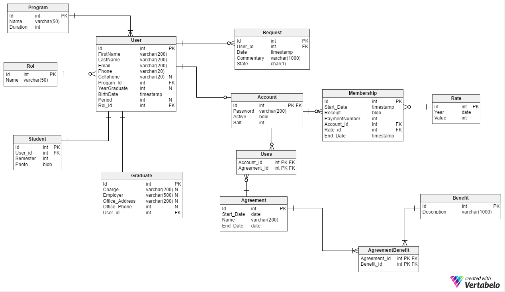

# AECI---Proyecto-PDSW
Este proyecto se realiza en la carrera Ingeniería de Sistemas de la Escuela Colombiana de Ingeniería Julio Garavito, para la materia Proceso de desarrollo de software, enfocado a resolver un problema real que posee la Asociación de Egresado de la Escuela Colombiana de Ingeniería Julio Garavito.
#Integrantes:
  -Hernán Felipe Losada
  -Kevin Jefrey Mendieta
  -Juan Alberto Mejía
  -Sebastian Moreno Rodriguez
  -Johan Sebastian Ramirez
#Descripción del problema
La Asociación no cuenta con un sistema de información que le ayude a administrar sus procesos, ni a guardar la información de sus usuarios, convenios, y servicios, no es sencillo para la administración generar certificados de afiliación, informar sobre convenios, ni recibir pagos, con este proyecto se busca dar una solución a este problema a través de una página web dinámica.
#Artefactos utilizados
El proyecto se realiza en el lenguaje Java, SQL, XML y HTML, se usa PrimeFaces como frameWork, myBatis.
#Base de datos

#Diagrama de clases

Url Circleci
https://circleci.com/gh/Chuzz1996/AECI---Proyecto-PDSW
Url Heroku 
http://aeci---proyecto-pdsw.herokuapp.com/
